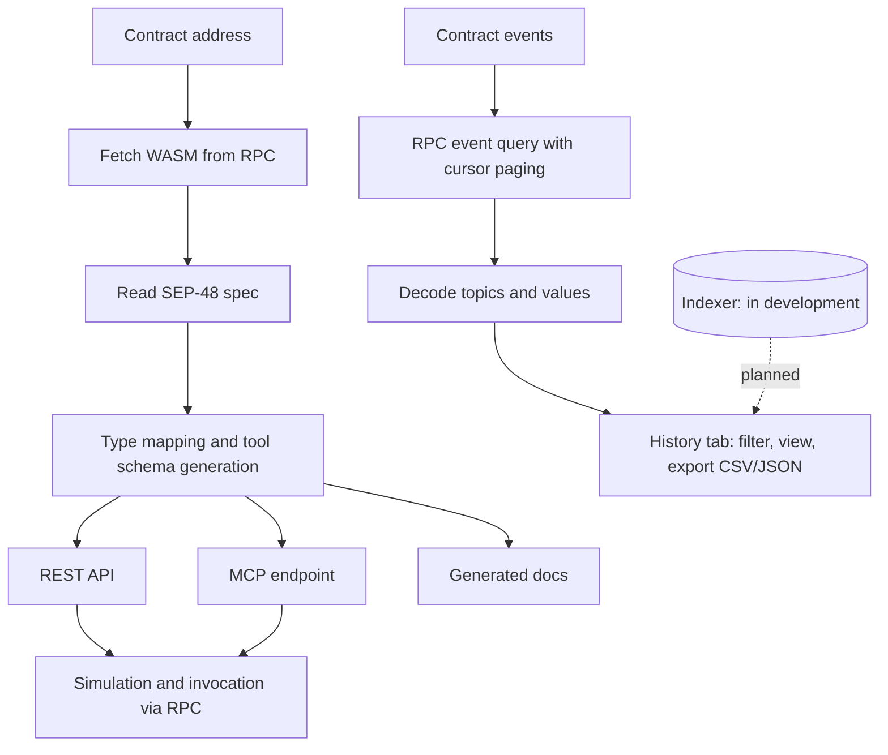

# Sonata

**The agent interface layer for Soroban.** Paste a contract address and get a live REST API, an MCP endpoint where every contract function becomes a callable tool for AI agents, generated docs, and queryable contract events.

Live: **https://sonata.brages.uk** · API: `https://api.sonata.brages.uk`

Stellar Pro Hackathon, Scale Track.

---

## The problem

Two things are missing before an AI agent can use a Soroban contract.

**Tooling is hand-written.** Existing agent tooling on Stellar ships a fixed set of network-level actions authored once: create account, check balance, send payment. A contract deployed today has no tools and waits for a human to write them. Coverage grows with someone's roadmap, not with the ecosystem.

**History does not persist.** Stellar RPC retains contract events for about seven days. Horizon keeps roughly a year but is not contract-event shaped. Stellar's full record lives in Hubble, a BigQuery dataset built for analysts that needs a GCP account, SQL, and per-query cost management. The data exists. Nothing an agent can call reaches it.

## What works today

- **Per-contract REST API**, typed from the contract's on-chain SEP-48 spec
- **Per-contract MCP endpoint** at `/c/{CONTRACT_ID}/mcp`, where every exported function becomes a callable tool
- **Generated docs**, derived from the contract spec rather than written by hand
- **Contract events**, decoded on demand from RPC, filterable by event type, address, and ledger or time range, exportable as CSV or JSON
- **Explorer and contract workspace** in the web UI
- **Flows**, multi-step operations published as a single reusable call

## What does not work yet

- **No indexing.** The History tab reads from RPC on demand, so the ~7 day retention limit still applies. Persistent event storage is the next build.
- **No deep backfill.** Full contract history from genesis is roadmap, planned via Hubble backfill.

We state this explicitly because the difference matters for anyone evaluating the project.

---

## Quickstart for judges

No setup required. These links hit the live deployment:

| Contract | Link |
|---|---|
| Hourglass Stream (testnet, ours) | [contract page](https://sonata.brages.uk/c/CB25NO7BEWVLTAUBAMPMUDIO6VGLBGZHN6TG4TKFNM3U5M5YEXVWEWNL) |
| [ADD: a mainnet protocol, e.g. Soroswap or Blend] | [link] |
| [ADD: a second mainnet contract] | [link] |

To use it from an AI agent, point any MCP client at: https://api.sonata.brages.uk/c/CB25NO7BEWVLTAUBAMPMUDIO6VGLBGZHN6TG4TKFNM3U5M5YEXVWEWNL/mcp


Every exported function of that contract appears as a callable tool. No install, no SDK, no configuration.

---

## Deployed contracts (Stellar Testnet)

| | |
|---|---|
| Name | Hourglass Stream (`STREAM`) |
| Contract ID | `CB25NO7BEWVLTAUBAMPMUDIO6VGLBGZHN6TG4TKFNM3U5M5YEXVWEWNL` |
| WASM hash | `a3d62dea9d471d3719ca53556e739864791cb43cea3a19033702317865fe4d35` |
| Deployed | 2026-09-15, ledger ~4687762 |
| Admin | `GBXDHEVCWZCP45D5VCBLYEQFX33DTHULU6KMH5YPJ54XXOJ6DO2P3MU2` |
| Built with | soroban-sdk 25.3.1, Rust 1.95, protocol 25 |
| Source | [ADD: link to the contract repo] |

A Sablier-style token streaming and vesting contract with NFT-wrapped streams (OpenZeppelin-stellar NonFungibleToken + Enumerable). 47 exported functions covering linear, tranched, recurring, and batch stream creation, withdrawal, cancellation, and the standard NFT interface. We use it as the reference contract for Sonata because no hand-written tooling exists for it, which is the case Sonata is built for.

---

## How it works



### Components

| Component | Responsibility |
|---|---|
| `server/` | API and MCP server. Fastify + Postgres. Fetches contract WASM, reads the SEP-48 spec, generates REST routes and MCP tool schemas, handles argument encoding, simulation, and invocation. See `server/README.md`. |
| `app/` | Next.js 15 App Router site. Routes: `/`, `/register`, `/contracts`, `/c/[id]/[tab]` (overview, functions, mcp, docs, history), `/explorer`, `/docs`. |
| `components/` | One component per screen and workspace tab. |
| `lib/` | API client, data hooks, argument-form helpers, UI kit loader. |
| `e2e/`, `vitest.config.mjs` | Playwright end-to-end tests and vitest unit tests on the lib layer. |

### Stellar integrations

- **SEP-48 contract spec.** The core dependency. Every Soroban contract carries its interface on-chain inside its WASM, which is why a contract address is the only input Sonata needs. Nothing is uploaded or configured.
- **Soroban RPC.** Contract WASM retrieval, simulation, invocation, and contract event queries with cursor paging.
- **Horizon.** Transaction lookup for event attribution.
- **Soroban SDK.** The reference contract is built with soroban-sdk 25.3.1.
- **Stellar CLI.** Used in development and in the benchmark baseline.
- **Stellar Skills.** [ADD: name the specific Skills you used and link them. The judging criteria ask for this explicitly.]

### Design decisions and trade-offs

**Hosted, not a local generator.** Tools that generate an MCP server from a contract spec exist, but you run and host them yourself. That is fine for one contract and unworkable for an agent that encounters contracts it has never seen. Hosting means a contract deployed minutes ago is callable immediately, with no step for the user. The trade-off is that we carry the infrastructure cost, which is why the hosted tier is where the business model lives.

**Per-contract generation, not a fixed tool set.** Hand-written tools cover whatever their authors got to. Generated tools cover everything, and coverage grows with the ecosystem rather than with our roadmap. The trade-off is that we cannot hand-tune semantics per contract, so tool descriptions are derived from spec names, types, and error enums.

**Indexing deferred.** The live path needs no indexing and works on every contract immediately, so we shipped that first. History is where the real infrastructure cost sits, so building it later keeps the MVP honest about what it can serve.

**Open core.** The indexer [ADD: is / will be] open source and self-hostable, so no one depends on a single operator running it.

### Technical challenges

**Type mapping across arbitrary ABIs.** A contract spec can contain nested structs, custom enums, vectors of composite types, and dependency-pulled types that are never exposed as functions. Generating a tool schema an LLM can fill correctly means mapping all of that into something JSON-schema shaped without losing the type information needed to encode the call.

**Argument encoding.** This is where an unassisted agent fails most often: it infers ScVal encodings and gets them wrong, then retries. Generating encoding from the spec removes the guessing entirely.

**RPC event paging.** Soroban RPC scans a bounded ledger range per call and returns an empty page without meaning the range is exhausted. Naive clients stop early and silently miss events. Our event reads page on the cursor to the head.

**Spec semantics without verified source.** Many deployed contracts have unverified WASM, so function meaning has to be derived from names, argument types, and the error enum rather than from source. We surface that provenance rather than presenting inferred semantics as fact.

---

## Running locally

```bash
npm install
npm run dev   # http://localhost:3000
```

The site talks to the Sonata API at `NEXT_PUBLIC_API_URL`, default `http://localhost:8080`. To run the API and MCP server locally, see `server/README.md`. To point the site at the hosted API, set `NEXT_PUBLIC_API_URL=https://api.sonata.brages.uk`.

### Tests

```bash
npm test            # vitest, lib layer
npm run test:e2e    # Playwright, needs the API and site running
```

---

## Benchmark

We compared an AI agent investigating a Soroban contract with and without Sonata, on the same model, the same prompts, and a cold context.

**Baseline:** agent with Stellar CLI, RPC, and Horizon access, no Sonata.
**Contract:** Hourglass Stream, 47 functions, 386 events.

| | Baseline | With Sonata |
|---|---|---|
| Wall clock | 5m 49s | [ADD] |
| Tool calls | 23 | [ADD] |
| Failed or wasted calls | 4 | [ADD] |
| Tokens | [ADD] | [ADD] |
| Correct | yes | [ADD] |

The baseline's wasted calls came from an empty event query, the debug detour that followed, a 403 on the default user agent, and independently rediscovering RPC cursor paging behavior mid-task. None of those are failures of intelligence. They are work that a typed, hosted interface does once instead of every time.

Full transcripts: [ADD: link to /benchmarks]

---

## Roadmap

**Phase 1, live now.** Per-contract REST and MCP endpoints, generated docs, Flows, on-demand event reads with CSV and JSON export.

**Phase 2.** Event indexing with retention past the RPC window. Deep history via Hubble backfill, full contract history from genesis served as agent-callable tools. Expanded Flows library. Per-call metering via x402.

**Phase 3.** Private and enterprise indexing, audit-grade export with per-row ledger sequence and transaction hash provenance.

**Next step after the hackathon:** Stellar Community Fund Build Award.

---

## Team

Built by the team behind Vestellar (a token streaming and vesting protocol, $5,000 InstAward through the Rise In x Stellar program), YieldPilot, and Hourglass Protocol.

## License

[ADD: Apache-2.0, and commit the LICENSE file]
